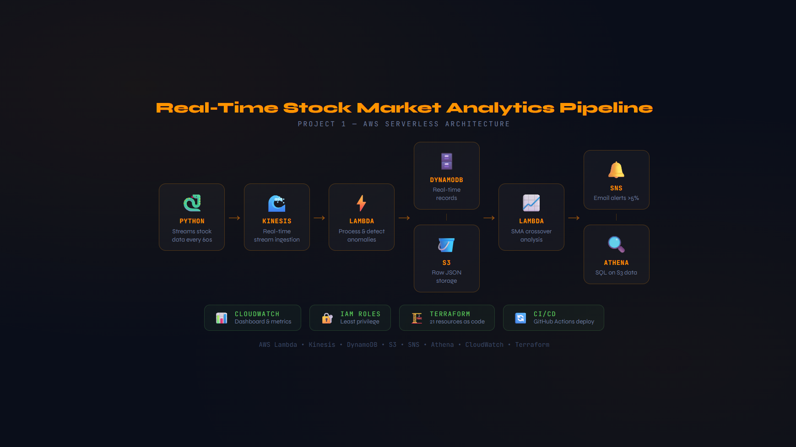
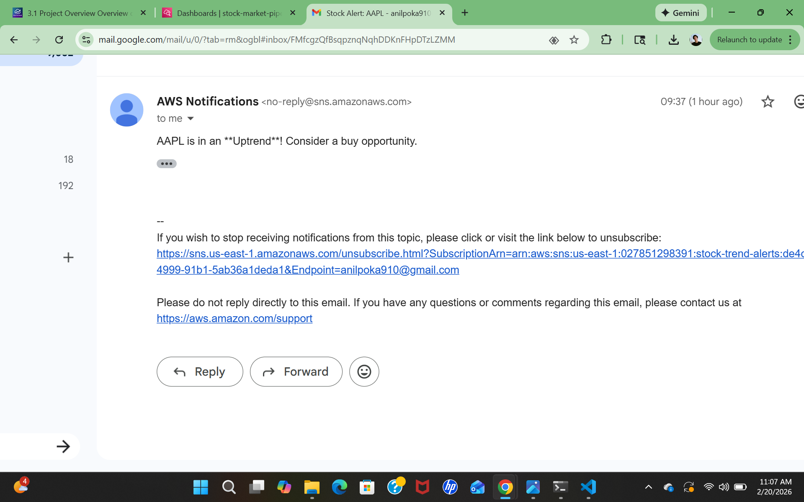
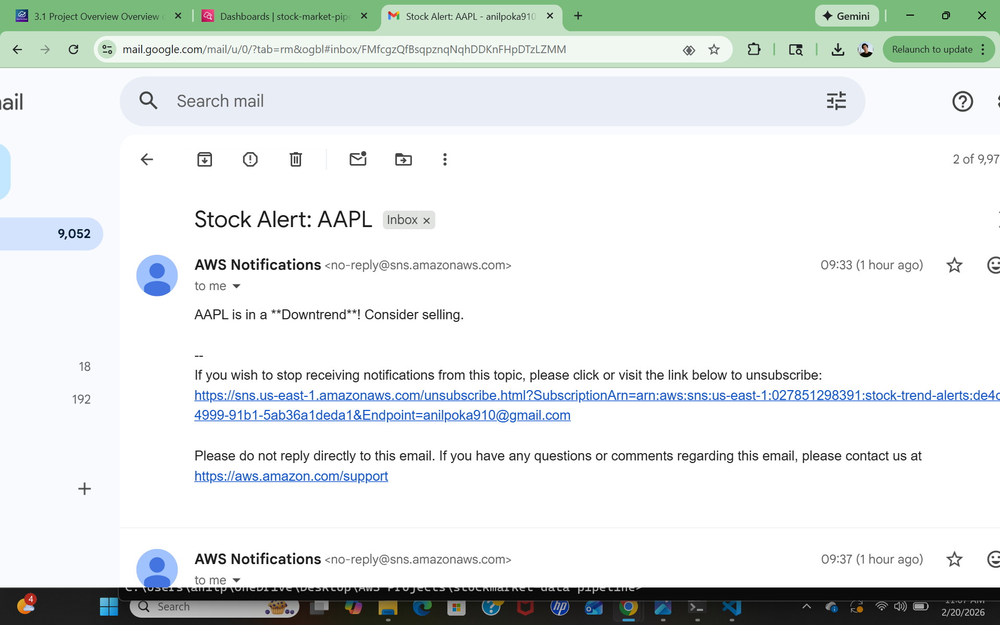

# AWS Real-Time Stock Market Analytics Pipeline

A production-grade, fully serverless data pipeline built on AWS that ingests, processes, stores, analyzes, monitors, and alerts on real-time stock market data — deployed entirely through Infrastructure as Code using Terraform.

---

## Live Pipeline Screenshots

### Architecture Diagram


### CloudWatch Monitoring Dashboard


### SNS Trend Alert — Uptrend (Golden Cross)


### SNS Trend Alert — Downtrend (Death Cross)



---

## What This Project Does

This pipeline fetches live Apple (AAPL) stock price data every 30 seconds and streams it through a fully automated event-driven architecture on AWS. It processes and stores structured data for real-time querying, archives raw data for historical analysis, detects stock trend reversals using financial moving average algorithms, fires real-time email and SMS alerts when trend crossovers are detected, and monitors the entire system through a live CloudWatch dashboard — all without managing a single server.

The entire infrastructure is managed as code using Terraform and can be destroyed and redeployed from scratch with two commands.

---

## Architecture

```
yfinance (Local Python Script)
        |
        | JSON stock data every 30 seconds
        v
Amazon Kinesis Data Streams (ON_DEMAND, 1 shard)
        |
        | Batch size 2, triggers every 60 seconds
        v
AWS Lambda — ProcessStockData (Python 3.13)
        |
        |-----> Amazon DynamoDB
        |       (structured processed records,
        |        partition key: symbol, sort key: timestamp)
        |            |
        |            | DynamoDB Streams — NEW_IMAGE
        |            v
        |       AWS Lambda — StockTrendAnalysis (Python 3.13)
        |            |
        |            | SMA-5 vs SMA-20 crossover detection
        |            v
        |       Amazon SNS — stock-trend-alerts
        |            |
        |            v
        |       Email / SMS Alert to Subscriber
        |
        |-----> Amazon S3 — raw JSON archive
                (s3://bucket/raw-data/AAPL/timestamp.json)
                     |
                     v
              AWS Glue Data Catalog
              (schema definition for Athena)
                     |
                     v
              Amazon Athena
              (SQL queries on historical S3 data)

All services monitored via Amazon CloudWatch Dashboard
All infrastructure managed via Terraform
```

---

## Infrastructure as Code — Terraform

This entire pipeline is managed with Terraform. Every AWS resource — Kinesis stream, Lambda functions, DynamoDB table, S3 buckets, SNS topic, IAM roles, Glue catalog, and event triggers — is defined as code and version controlled in GitHub.

**Deploy the entire pipeline from scratch:**
```bash
cd terraform
terraform init
terraform apply
```

**Tear down all 21 resources:**
```bash
terraform destroy
```

**Rebuild from zero after destroy:**
```bash
terraform apply
```

The complete pipeline redeploys in under 2 minutes from any machine with AWS credentials configured.

---

## Services Used & Why

| Service | Purpose | Why This Over Alternatives |
|---|---|---|
| Amazon Kinesis | Real-time data ingestion | Ordered high-throughput streaming with multiple consumer support. Chose over SQS because stock data requires ordering and replay capability |
| AWS Lambda | Processing, anomaly detection, trend analysis | Serverless auto-scaling matches variable market volume. No idle server costs unlike EC2 |
| Amazon DynamoDB | Structured data storage | Millisecond read/write for real-time queries. Chose over RDS because flexible schema and speed matter more than relational joins |
| DynamoDB Streams | Change data capture | Triggers trend analysis Lambda on every new record without polling. Guarantees data is persisted before analysis begins |
| Amazon S3 | Raw data archive | Cheapest long-term storage at pennies per GB. Enables Athena queries without a running database |
| AWS Glue | Schema catalog | Defines S3 data structure so Athena can query raw JSON without loading into a database |
| Amazon Athena | Historical SQL analysis | Pay-per-query serverless SQL. Chose over Redshift to avoid 24/7 cluster costs for occasional historical queries |
| Amazon SNS | Real-time alerts | Fan-out notification system. One Lambda publish notifies all subscribers simultaneously across email and SMS |
| Amazon CloudWatch | Monitoring and observability | Live dashboard tracking Lambda errors, invocation counts, DynamoDB latency, and Kinesis throughput in one place |
| IAM Roles | Security and permissions | Least-privilege access between all services. Separate roles per Lambda function |
| Terraform | Infrastructure as Code | Entire pipeline defined as version-controlled code. Repeatable deployments in under 2 minutes |

---

## Key Design Decisions

**Why Kinesis over SQS?**
Stock data requires ordered ingestion with the ability for multiple consumers to read the same stream simultaneously. SQS is better for simple decoupled task queues where ordering doesn't matter. Kinesis was the right choice for a streaming analytics use case.

**Why DynamoDB over RDS?**
Millisecond read/write latency is required for real-time stock lookups and trend calculations. DynamoDB's flexible schema also makes it easy to evolve the data model without migrations. RDS would be overkill and more expensive for this workload.

**Why S3 and Athena for historical analysis instead of just using DynamoDB?**
DynamoDB charges per read operation. Scanning thousands of historical records for trend analysis is expensive and slow at scale. S3 storage costs pennies per GB and Athena charges per query scanned — dramatically cheaper for occasional historical analysis. DynamoDB handles real-time fast lookups. S3 and Athena handle cheap historical analysis. Using both gives speed and cost efficiency.

**Why two Lambda functions instead of one?**
Separation of concerns. ProcessStockData handles ingestion and storage — it must be fast and lightweight. StockTrendAnalysis handles complex SMA calculations requiring historical DynamoDB data. Combining them would create a slow tightly coupled function that is harder to debug, scale, and maintain independently.

**Why DynamoDB Streams instead of triggering trend Lambda from Kinesis?**
Trend analysis requires historical data already stored in DynamoDB. Triggering from Kinesis would mean the trend Lambda runs before data is persisted. DynamoDB Streams guarantees the record exists in the table before trend analysis begins — eliminating a race condition.

**Why Terraform over console?**
Clicking through the AWS console is not repeatable or version controlled. Terraform means any engineer can clone this repo and redeploy the complete infrastructure from scratch with two commands. It also means changes are reviewed before deployment and rollbacks are possible.

**Why ON_DEMAND Kinesis mode?**
Eliminates the need to pre-provision shards and fits within AWS Free Tier. Auto-scales with throughput automatically. For a single stock at 30-second intervals this is significantly more cost-efficient than provisioned mode.

---

## How Trend Detection Works

The StockTrendAnalysis Lambda implements a real financial trading algorithm using Simple Moving Averages — the same concept used by professional traders worldwide.

**SMA-5** — average price of the last 5 readings. Reacts quickly to recent price movements.

**SMA-20** — average price of the last 20 readings. Moves slowly and represents the broader trend.

**Golden Cross — BUY signal:**
When SMA-5 crosses above SMA-20 it means short-term momentum is accelerating upward. Lambda publishes an SNS alert: "AAPL is in an Uptrend. Consider a buy opportunity."

**Death Cross — SELL signal:**
When SMA-5 crosses below SMA-20 it means short-term momentum is dropping. Lambda publishes an SNS alert: "AAPL is in a Downtrend. Consider selling."

During a 30-minute live test both a Golden Cross and Death Cross were detected and SNS email alerts were delivered in real time confirming the complete end-to-end system works.

The function requires a minimum of 20 records in DynamoDB before analysis begins — approximately 10 minutes of script runtime.

---

## Data Schema

Each processed record stored in DynamoDB:

| Field | Type | Description |
|---|---|---|
| symbol | String | Stock ticker (AAPL) — Partition Key |
| timestamp | String | ISO 8601 UTC timestamp — Sort Key |
| open | Decimal | Opening price |
| high | Decimal | Day high |
| low | Decimal | Day low |
| price | Decimal | Current price |
| previous_close | Decimal | Previous day closing price |
| change | Decimal | Price change from previous close |
| change_percent | Decimal | Percentage change |
| volume | Integer | Trading volume |
| moving_average | Decimal | Average of open, high, low, close |
| anomaly | String | "Yes" if abs(change) > 5%, else "No" |

---

## Athena Queries

```sql
-- Basic data retrieval
SELECT * FROM stock_data_table LIMIT 10;

-- Top 5 price movements
SELECT symbol, price, previous_close,
       (price - previous_close) AS price_change
FROM stock_data_table
ORDER BY price_change DESC
LIMIT 5;

-- Average trading volume per stock
SELECT symbol, AVG(volume) AS avg_volume
FROM stock_data_table
GROUP BY symbol;

-- Anomalous price movements greater than 5 percent
SELECT symbol, price, previous_close,
       ROUND(((price - previous_close) / previous_close) * 100, 2) AS change_percent
FROM stock_data_table
WHERE ABS(((price - previous_close) / previous_close) * 100) > 5;
```

---

## CloudWatch Monitoring Dashboard

A live CloudWatch dashboard monitors the entire pipeline with the following widgets:

- Lambda invocation count and error rate for ProcessStockData and StockTrendAnalysis
- Kinesis incoming records and throughput per shard
- DynamoDB SuccessfulRequestLatency for Query and Scan operations
- Lambda duration trends over time

This provides complete observability into every layer of the pipeline from a single screen — the same approach used in production cloud environments.

---

## Project Structure

```
aws-stock-market-pipeline/
├── README.md
├── architecture-diagram.png
├── cloudwatch-dashboard.png
├── sns-uptrend-alert.png
├── sns-downtrend-alert.png
├── dynamodb-records.png
├── s3-raw-data.png
├── src/
│   └── stream_stock_data.py       # Fetches AAPL data and streams to Kinesis every 30s
├── lambda/
│   ├── lambda_function.py         # ProcessStockData — processes Kinesis records
│   └── stock_trend_alert.py       # StockTrendAnalysis — SMA calculations and SNS alerts
├── athena/
│   └── queries.sql                # Historical analysis SQL queries
├── terraform/
│   ├── main.tf                    # All 21 AWS resources defined as code
│   ├── variables.tf               # Configurable variables with defaults
│   ├── outputs.tf                 # Post-deployment output values
│   └── providers.tf               # AWS provider configuration
└── docs/
    └── design-decisions.md        # Detailed architectural reasoning
```

---

## Challenges and Lessons Learned

**Hidden Unicode character bug in Lambda:** Copy pasting code from documentation into the Lambda editor embedded invisible zero-width space characters (U+200B) causing a Runtime.UserCodeSyntaxError on a line that looked visually correct. Identified by checking CloudWatch logs and scanning for yellow highlighted characters in the Lambda code editor. Fixed by deleting the affected line and retyping manually. Lesson: always scan for yellow highlights in the Lambda editor before clicking Deploy.

**Silent Lambda execution:** The StockTrendAnalysis Lambda silently skipped all analysis when fewer than 20 DynamoDB records existed. With no print statements in the original code it was impossible to tell if it was working or skipping. Added meaningful logging throughout the function to surface record counts, SMA values, and alert decisions in CloudWatch. Lesson: never write Lambda functions without logging — silent code is impossible to debug in serverless environments.

**Kinesis is a pipe not storage:** Data disappears from Kinesis after Lambda consumes it. Kinesis is a temporary streaming pipe with 24-hour retention by default. Permanent storage is DynamoDB and S3. This is by design for streaming architectures.

**Terraform immutable properties:** Changing a Lambda function name in Terraform forces a destroy and recreate because AWS does not allow renaming existing Lambda functions. Learned the difference between in-place updates and forced replacements by observing the -/+ symbol in terraform plan output.

**Environment variables over hardcoded values:** Initial Lambda code had hardcoded table names and SNS ARNs. Refactored to use os.environ to read values injected by Terraform as environment variables. This makes the code portable, cleaner, and eliminates sensitive resource names from source code.

---

## Cost Estimate

This pipeline runs at approximately $1-2 per month within AWS Free Tier limits.

| Service | Free Tier | Project Usage |
|---|---|---|
| Kinesis | 1 shard free | 1 shard, approximately 2880 records per day |
| Lambda | 1M requests per month free | Approximately 2880 invocations per day per function |
| DynamoDB | 25GB storage free | Less than 1MB |
| S3 | 5GB free | Less than 1MB |
| Athena | $5 per TB scanned | Minimal — small dataset |
| SNS | 1M notifications free | Minimal |
| CloudWatch | 10 metrics free | Under free tier limit |
| Terraform | Free | Open source |

Always stop the Python script with CTRL+C when not testing. Leaving it running continuously will exceed free tier limits.

---

## What I Would Do Differently At Scale

- Replace single-stock AAPL feed with multi-stock ingestion using multiple Kinesis shards — one partition key per stock symbol for ordered per-symbol processing
- Add Kinesis Data Firehose for automatic S3 batching instead of Lambda writing individual JSON files
- Configure Terraform remote state in S3 with DynamoDB state locking for team collaboration
- Add Dead Letter Queue on Lambda event source mappings so failed records are captured instead of silently dropped
- Replace the simple 5% anomaly threshold with a SageMaker ML model trained on historical S3 data
- Use AWS Secrets Manager for all sensitive configuration instead of environment variables
- Add separate Terraform workspaces for dev, staging, and production environments
- Implement CloudWatch alarms that trigger SNS alerts when Lambda error rates exceed a threshold

---

## Setup and Deployment

**Prerequisites**
- AWS Account with IAM user configured
- AWS CLI installed and configured (`aws configure`)
- Terraform installed (v1.0+)
- Python 3.8+ with boto3 and yfinance (`pip install boto3 yfinance`)

**Deploy infrastructure**
```bash
cd terraform
terraform init
terraform apply
```

**Run the pipeline**
```bash
python src/stream_stock_data.py
```

**Stop the pipeline**
```
CTRL+C
```

**Tear down all infrastructure**
```bash
cd terraform
terraform destroy
```

---

## Author

Built as part of a cloud engineering portfolio to demonstrate production-grade AWS architecture, serverless computing, event-driven design, Infrastructure as Code, financial algorithms, and operational observability practices.
